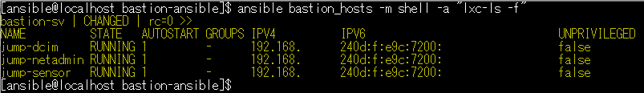
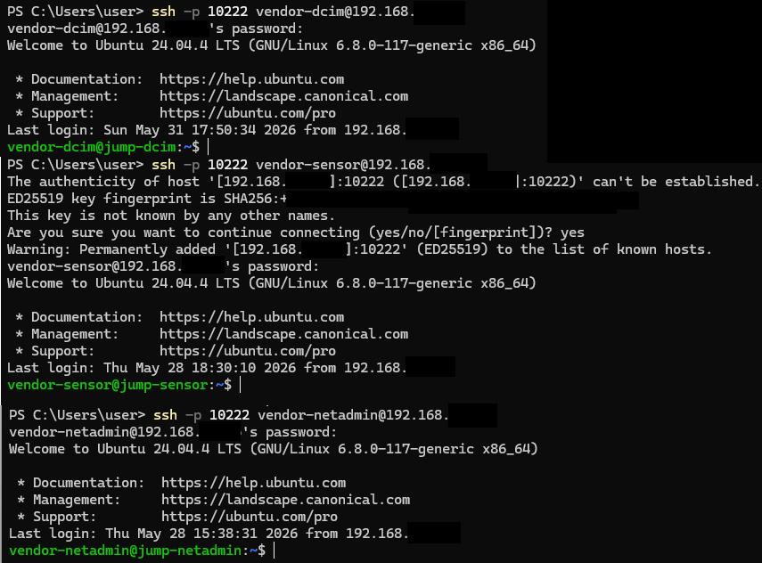
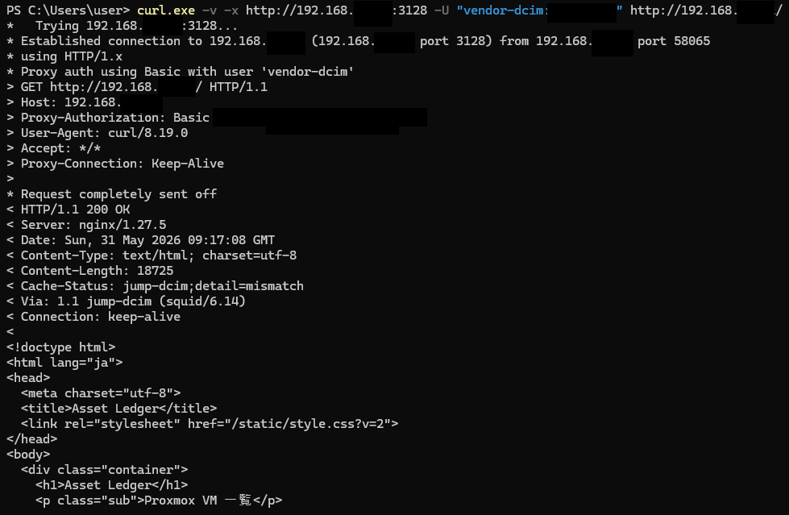
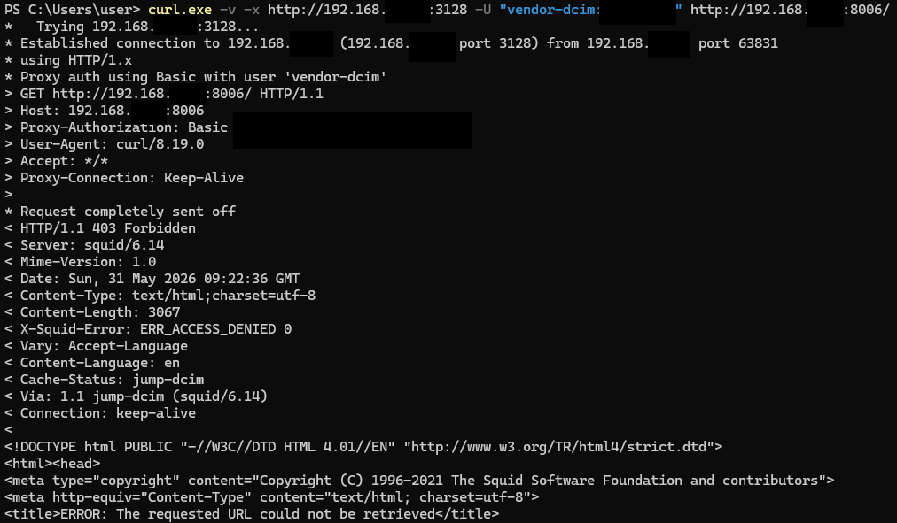
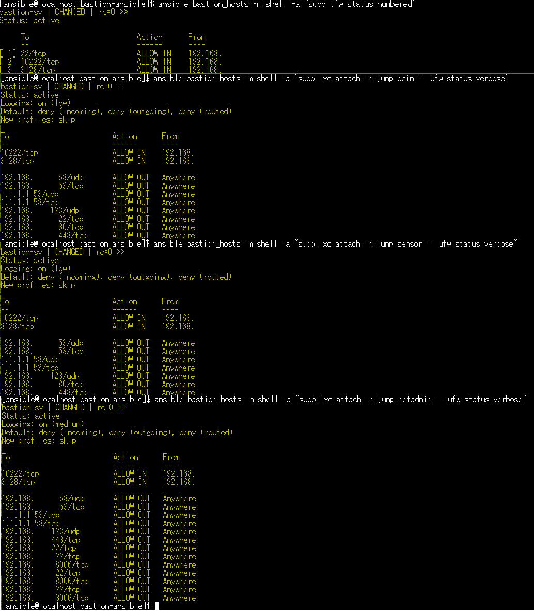

# bastion-ansible

Ansible playbook for building an LXC-based bastion and proxy lab environment on Ubuntu Server.

This project is intended for infrastructure learning, bastion server design practice, and validation of vendor-specific restricted access workflows.

## Overview

This playbook builds a lightweight bastion environment using LXC containers.

Each vendor or operator can be assigned to a dedicated LXC bastion container.
Access is restricted by SSH, Squid proxy ACLs, UFW firewall rules, PAM password policy, and host-side auditd monitoring.

The design is useful for validating zero-trust-like access control patterns in a lab environment.

## Architecture

```text
Client / Vendor PC
        |
        | SSH 10222 / Proxy 3128
        |
Ubuntu LXC Host VM
        |
        +-- jump-dcim
        |     - SSH access on 10222
        |     - Squid proxy on 3128
        |     - Access only to allowed DCIM/Web targets
        |
        +-- jump-sensor
        |     - SSH access on 10222
        |     - Squid proxy on 3128
        |     - Access only to allowed monitoring/Web targets
        |
        +-- jump-netadmin
              - SSH access on 10222
              - Squid proxy on 3128
              - Access to allowed routers, switches, and Proxmox VE nodes
```

## ## Screenshots / Verification

This section shows example verification results for the LXC-based bastion and proxy lab environment.

For security reasons, IP addresses, hostnames, usernames, and internal URLs may be masked in the screenshots.

### Ansible Playbook Result


The Ansible playbook completed successfully and configured the LXC host, containers, SSH access, Squid proxy, UFW rules, PAM password policy, and auditd monitoring.

### LXC Container List



Each vendor or operator role is assigned to a dedicated LXC bastion container.

Example roles:

* `jump-dcim`
* `jump-sensor`
* `jump-netadmin`

### SSH Login Test



SSH access is provided through a custom port such as `10222`.

Example:

```bash
ssh -p 10222 vendor-netadmin@example-bastion-ip
```

This verifies that a vendor/operator can log in only through the assigned bastion container.

### Squid Proxy Allowed Access



The Squid proxy allows access only to approved destinations.

Example:

```bash
curl -k -v -x http://example-bastion-container-ip:3128 \
  -U "vendor-netadmin:PROXY_PASSWORD" \
  https://example-proxmox-ip:8006/
```

Expected result:

```text
HTTP/1.1 200 OK
```

### Squid Proxy Denied Access



Access to non-approved destinations is denied by Squid ACLs.

Example:

```bash
curl -k -v -x http://example-bastion-container-ip:3128 \
  -U "vendor-netadmin:PROXY_PASSWORD" \
  https://not-allowed-target.example.local/
```

Expected result:

```text
HTTP/1.1 403 Forbidden
```

### Firewall Status



UFW is used to restrict inbound access and optionally control outbound traffic from each bastion container.

### Audit Log Verification


Host-side `auditd` monitors important LXC configuration files and security-related changes.

Example:

```bash
ausearch -k lxc_config
```

### Web UI Access Through Bastion Proxy


This verifies restricted web access to an allowed internal management system, such as Proxmox VE, DCIM, or a monitoring web UI, through the bastion proxy.


## Main Features

* Ubuntu Server 24.04 based LXC host
* LXC default NAT bridge `lxcbr0` disabled
* Linux bridge `br0` for L2-connected LXC containers
* Dedicated LXC containers per vendor/operator role
* SSH access on custom port `10222`
* Squid forward proxy with basic authentication
* Squid ACL-based destination control
* UFW inbound and optional outbound restrictions
* PAM password quality policy using `libpam-pwquality`
* Host-side auditd rules for LXC configuration and important files
* Logrotate configuration for UFW and Squid logs

## Example Use Cases

* Vendor-specific proxy access to DCIM or monitoring systems
* Restricted access to Proxmox VE GUI on port `8006`
* Restricted SSH access to routers, switches, and Proxmox VE nodes
* Lab validation of bastion server and restricted access design
* Training environment for network and infrastructure security operations

## Directory Structure

```text
bastion-ansible/
├── ansible.cfg
├── inventory.ini.example
├── group_vars/
│   └── all.yml.example
├── roles/
│   ├── common/
│   ├── lxc_host/
│   ├── lxc_network/
│   ├── lxc_containers/
│   ├── lxc_container_base/
│   ├── lxc_container_firewall/
│   ├── lxc_container_proxy/
│   └── lxc_host_audit/
└── site.yml
```

## Requirements

* Ubuntu Server 24.04 target host
* Ansible control node
* SSH access to the target host
* Sudo privileges for the Ansible user
* Network connectivity from LXC containers to allowed target systems

## Usage

Copy the example inventory file:

```bash
cp inventory.ini.example inventory.ini
```

Copy the example variable file:

```bash
cp group_vars/all.yml.example group_vars/all.yml
```

Edit the variables for your environment:

```bash
vi inventory.ini
vi group_vars/all.yml
```

Run syntax check:

```bash
ansible-playbook site.yml --syntax-check
```

Apply the playbook:

```bash
ansible-playbook site.yml
```

## Example Access Tests

SSH to a vendor-specific LXC bastion:

```bash
ssh -p 10222 vendor-netadmin@example-bastion-ip
```

Use Squid proxy from a client:

```bash
curl -k -v -x http://example-bastion-container-ip:3128 \
  -U "vendor-netadmin:PROXY_PASSWORD" \
  https://example-proxmox-ip:8006/
```

Test denied access:

```bash
curl -k -v -x http://example-bastion-container-ip:3128 \
  -U "vendor-netadmin:PROXY_PASSWORD" \
  https://not-allowed-target.example.local/
```

Expected result:

```text
HTTP/1.1 403 Forbidden
```

## Logs

Squid access logs inside each LXC container:

```bash
/var/log/squid/access.log
```

SSH authentication logs inside each LXC container:

```bash
/var/log/auth.log
journalctl -u ssh
```

Host-side audit logs on the LXC host:

```bash
/var/log/audit/audit.log
ausearch -k <audit_key>
```

UFW logs may not always appear inside LXC containers because LXC shares the host kernel.
Use Squid logs, SSH logs, and host-side auditd logs as primary audit evidence.

## Security Notes

Before using this project in production, review and harden the following:

* Firewall policy
* Outbound access restrictions
* SSH key authentication
* Password policy
* Log retention
* Centralized log forwarding
* Backup and restore procedures
* TLS/HTTPS configuration
* User privilege design
* Proxmox VE user roles and permissions
* Network device access permissions

Do not publish real environment values.

Before publishing this repository, make sure the following information is not included:

* Real IP addresses
* Real hostnames
* Passwords
* API tokens
* SSH private keys
* Vault password files
* Internal domain names
* Customer or company confidential information

Use example values such as:

```text
192.168.56.0/24
example.local
CHANGE_ME
```

## Notes

This project is for lab and validation use.
Additional design, hardening, and operational review are required for production use.

